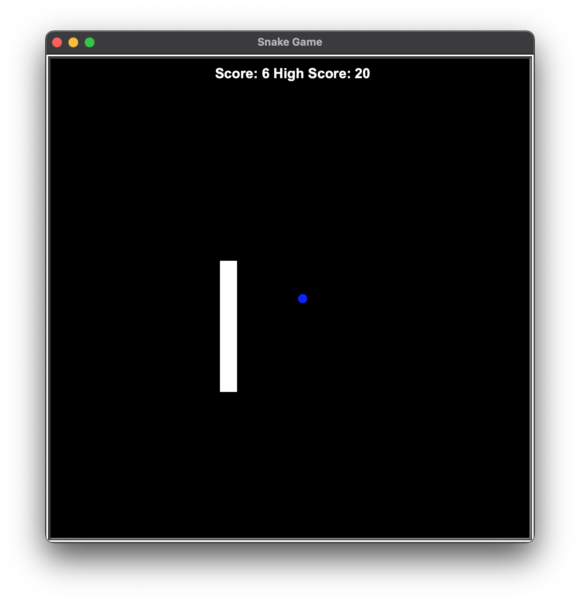

# snake-game-Python
This is a simple snake game built using Python Turtle module.

## Installation
Git clone https://github.com/Hussein-omar-osman/snake-game-Python.git

Create a virtual environment: python3 -m venv env

Activating virtual environment: source env/bin/activate

Run: pip install -r requirements.txt to install

Finally, have some fun and enjoy the simplest snake game.

### Live play:
